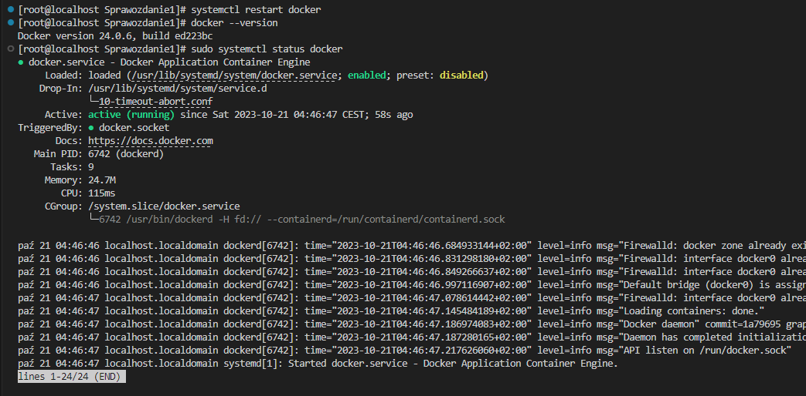
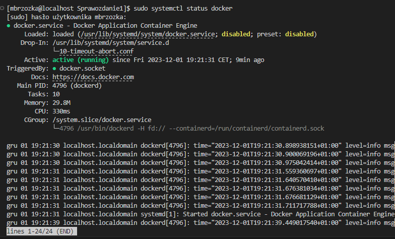
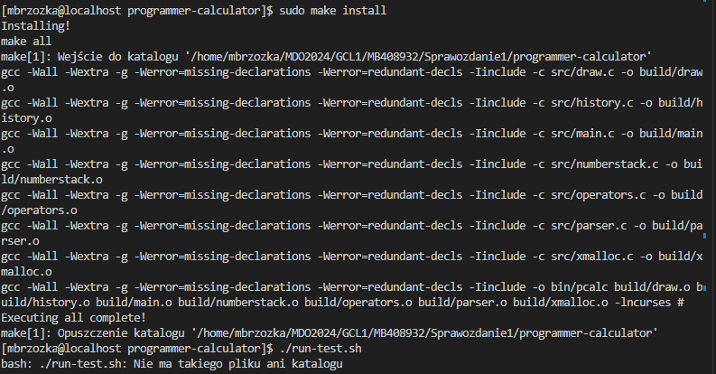
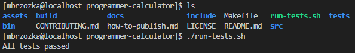
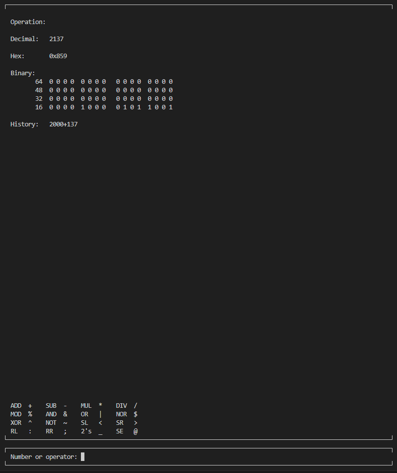
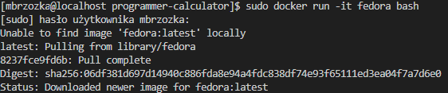
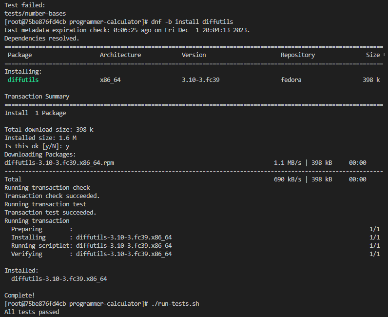
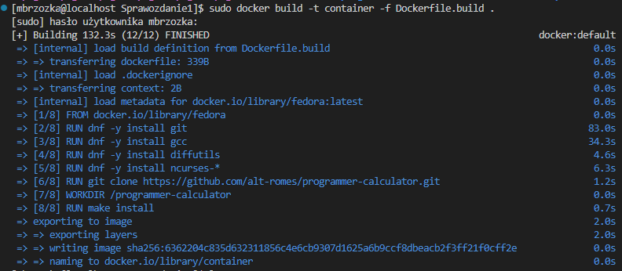
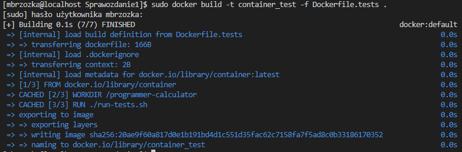
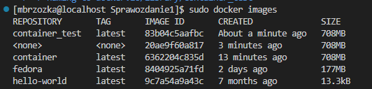

## Sprawozdanie 1
# Aby wykonać to ćwiczenie wykorzystałem następujące narzędzia:
* Visual Studio Code 
* VirtualBox, z zainstalowanym oprogramowaniem Fedora Server
* Git
* Docker zainstalowany podczas pierwszych zajęć

 
# Repozytorium wybrane do realizacji ćwiczenia 
Do zrealizowania ćwiczenia wybrałem repozytorium zawierające kod oprogramowania które spełniało wszystkie wymagania określone w instrukcji wykonania zadania takie jak: 
* Licencja 
* Dostępny plik Makefile ułatwiający uruchomienie oprogramowania 
* Testy

Po sprawdzeniu wielu repozytoriów wybrałem to które najlepiej spełniało powyższe wymagania i było odpowiednie do wykonania ćwiczenia a w poźniejszym czasie sporządzenia Sprawozdania

Repozytorium ktore wybrałem to: https://github.com/alt-romes/programmer-calculator

Jest to prosty kalkulator który posiada Makefile pomagający w przeprowadzeniu budowy programu. 

# Proces wykonywania ćwiczenia

1. Pierwszym etapem ćwiczenia było pobranie repozytorium 
```bash
$ git clone https://github.com/alt-romes/programmer-calculator.git
```

Następnie sprawdziłem działanie programu poprzez wykorzystanie pliku Makefile. Aby plik ten mógł działać poprawnie niezbędne było zainstalowanie pakietu gcc i bibliotekę ncurces.

```bash
$ sudo yum install gcc
$ sudo yum install ncurses-*
```

Kolejnym krokiem było zbudowanie i uruchomienie programu. Zrobiłem to za pomocą komendy:

```bash
$ sudo make install 
```



Po poprawnym zbudowaniu programu postanowiłem usuchomić wbudowane testy dostępne w pobranym repozytorium



Po poprawnym przejściu wszytkich testów uruchomiłem zbudowany program



2. Następnym etapem ćwiczenia było wykonanie przedstawionych czynności w kontenerze dockera. Pierwszym etapem pracy z dockerem było stworzenie nowego kontenera. Użyłem do tego komendy:

```bash
$ sudo docker run -it fedora bash
```



W tym etapie powtórzyłem wszystkie ktroki aby zbudować i uruchomić program w taki sam sposób w jaki zaprezentowano powyżej. Zacząłem od zainstalowania gita i potrzebnych bibliotek. Jedyny problem napotkałem podczas uruchamiania testów z repozytorium. Odkryłem że kontener nie zawiera biblioteki diffutills która jest niezbędna do przeprowadzenia testów. Jest to krok który będę musiał uwzględnić podczas sporządzania pliku Dockerfile. 



3. Następnym etapem będzie stworzenie dwóch plików Dockerfile do pełnego zbudowania programu i uruchomienia testów z repozytorium. Plik ten zawiera wszystkie instrukcje potrzebne do wykonania tych czynności. 
Pierwszym stworzony plik ma postać:

```dockerfile
FROM fedora
RUN dnf -y install git 
RUN dnf -y install gcc 
RUN dnf -y install diffutils 
RUN dnf -y install ncurses-*
RUN git clone https://github.com/alt-romes/programmer-calculator.git
WORKDIR /programmer-calculator
Run make install
```



Drugi plik ma nazwę Dockerfile.tests i służy on do odpalania testów z repozytorium:

```dockerfile
FROM container
WORKDIR /programmer-calculator
RUN ./run-tests.sh
```



Po wykonanych krokach możemy sprawdzić czy utworzone kontemery działają:


