## Sprawozdanie 2
# Aby wykonać to ćwiczenie wykorzystałem następujące narzędzia:
* Visual Studio Code 
* VirtualBox, z zainstalowanymi dwiema maszynami wirualnymi z oprogramowaniem Fedora Server
* Git
* Ansible

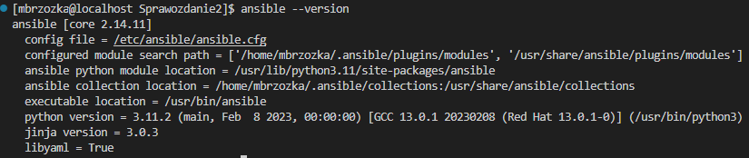

# Ping do nowej maszyny 
Łączność obu maszyn sprawdziłem wykonując ping z pierwszej maszyny na drugą.

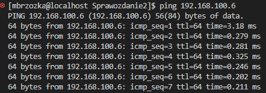

# Łączność pomiędzy maszynami za pomocą kluczy SSH

Dokonałem wymiany kluczy SSH pomiedzy dwoma stworzonymi maszynami za pomocą komend:

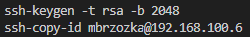

Wymiana kluczy umożliwiła łączność miedzy kluczami bez konieczności podawania hasła:

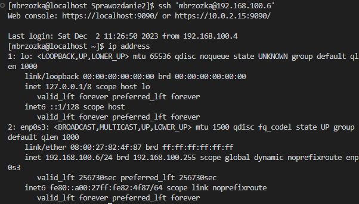

# Zadanie 

Pierwszym krokiem zadania było stworzenie pliku inventory.ini

```ini
[Machines]
192.168.100.6

[Orchestrators]
192.168.100.4
```
Wykonałem ping za pomocą Ansibla używając komendy:

```bash
ansible Machines -m ping -i ./inventory.ini
```
Rezultatem próby łączności było: 

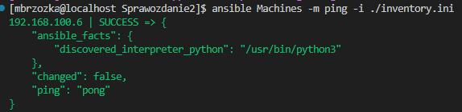

Kolejnym krokiem było stworzenie pliku "env". Do wykonania tego kroku użyłem komendy 

```bash
env > env
```
Stworzyłem plik miniplay w formacie .yaml którego zadanem jest utworzenie na drugiej maszynie katalogu "uploads" a następnie skopiowanie pliku "env" z pierwszej maszyny i umieszczenie go w wyżej wymienionym katalogu. Następnym krokiem pliku miniplay.yaml było sprawdzenie dnf-plugins-core, następnie pobranie repozytorium dockera i zaintalowanie go na drugiej maszynie. Ostatnim etapem pliku było uruchomienie na maszynie kontenera nginx. Plik ten znajduję się w katalogu "Sprawozdanie2" dlatego nie zamieszczam tutaj jego pełnego kodu.

Rezultat w terminalu:

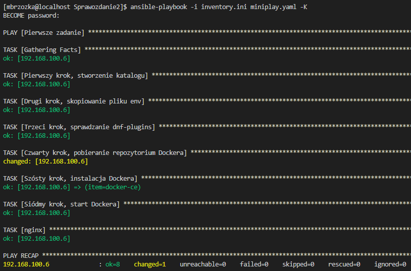

Aby upewnić się że cały etap przebiegł poprawinie przechodzimy na drugą maszynę. 

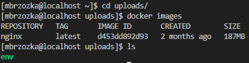

# Kickstart

Następnym zadaniem do wykoannia było przygotowanie pliku kickstart. Zaczynamy od zlokalizowania pliku anaconda-ks.cfg na drugiej maszynie. Plik ten zawiera ustawienia maszyny. 

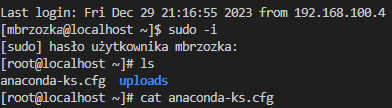

Następnie modyfikujemy plik zgodnie z instrukcją do zadania. W pierwszej kolejności wyszukujemy pakiety które zainstalowaliśmy na pierwszej maszynie. Robimy to za pomocą komendy 

```bash
rpm -qa
```
Następnie dodajemy nazwy pakietów do pliku anaconda-ks.cfg

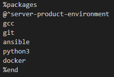

oraz repozytoria

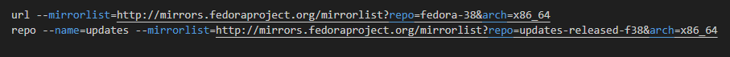

Kolejnym krokiem jest zmiana polecenia 

```bash
clearpart --none --initlabel
```
na 

```bash
clearpart --all --initlabel
```
Ostatnim krokiem było przesłanie pliku anaconda-ks.cfg na repozytorium i instalacja Fedory za pomocą formatu raw

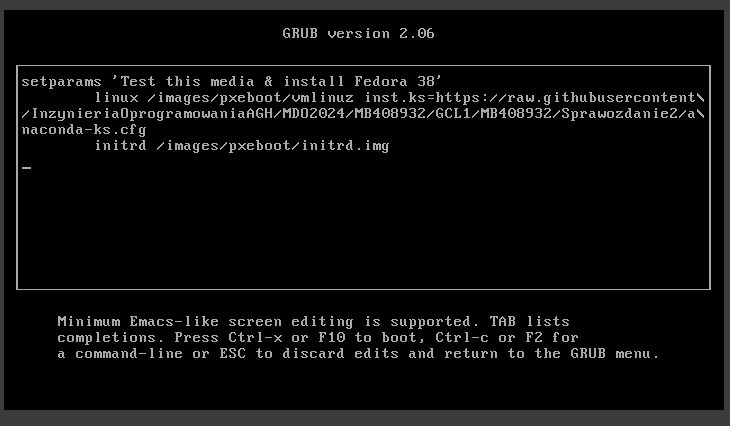

Instalujemy maszynę i sprawdzamy czy zostały zainstalowane wszystkie pakiety które umieściliśmy w pliku

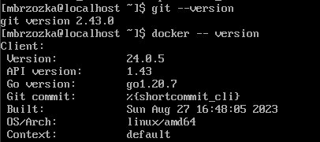
