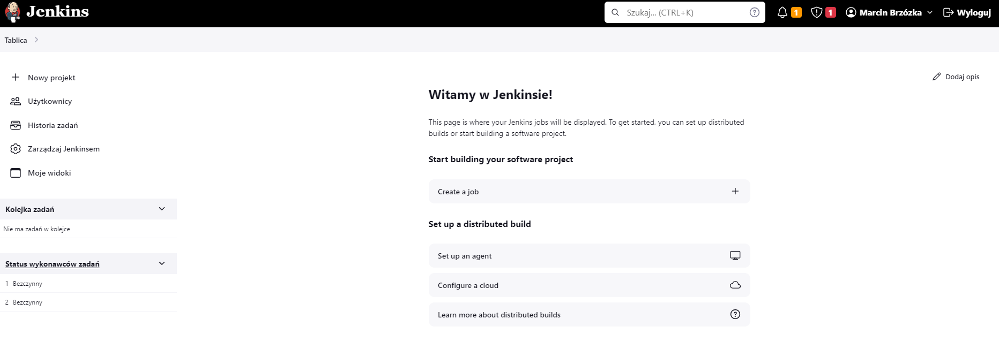
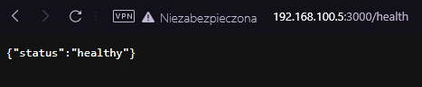

### Sprawozdanie 2
## Aby wykonać to ćwiczenie wykorzystałem następujące narzędzia:
* Visual Studio Code 
* VirtualBox, z zainstalowaną maszyną wirtualna z oprogramowaniem Fedory
* Środowisko Jenkins

## Przebieg wykonywania ćwiczenia:
Wykonywanie ćwiczenia rozpocząłem od stworzenia Dockerfile dla wybranego programu i przetesowanie go na zbudowanym w maszynie kontenerze dockerowym:


Wykonałem również dostępne testy aplikacji: 


Do katalogu z plikami dockerfile dodałem ten który będzie oppowiadał za deploy aplikacji. Odpowiada on za uruchomienie aplikacji w kontenerze. W pliku tym umieszczam port na ktorym ma uruchomić się nasza aplikacja oraz komendę CMD.


Następnym krokiem było uruchomienie aplikacji na porcie 3000:


Aby sprawdzić czy kontener jest uruchomiony wykorzystujemy komendę:

```bash
docker ps
```


# Konfiguracja i praca z Jenkinsem
Pierwszym krokiem była konfiguracja i pierwsze uruchomienie Jenkinsa. Do zrobienia tego wykorzysałem instrukcję dostępną na oficjalnej stronie Jenkinsa. Po wykonaniu wszystkich opisanych kroków wymaganych do zbudowaania kontenera jenkins oraz dind sprawdzam poprawność ich działania ponownie korzystająć z komendy:

```bash
docker ps
```


Jak możemy zauważyć oba kontenery są zbudowane w odpowiedni sposób i działają poprawnie. Kolejnym krokiem było odwiedzenie adresu pod krórym znajdował się kontener. Znajduję się on na porcie 8080 dlatego w moim prypadku adres wyglądał następująco: 

```bash
http://192.168.100.4:8080
```
Podczas pierwszej wizyty pod wymienionym wyżej adresem zostaniemy poproszeni o hasło które jesteśmy w stanie uzyskać odnajdując go w naszej maszynie. Wykorzystujemy do tego następująca komendę:


Po wklejeniu hasła w odpowiednie miejsce jesteśmy w wstanie utworzyć nazwę użytkownika i hasło. Następnie wykonuję się dalsza konfiguracja Jenkinsa:


Po zakończonym procesie konfiguracji na ekranie pojawia się nam strona startowa Jenkinsa


Następnym krokiem będzie przetestowanie Jenkinsa. W tym celu tworzę nowy projekt wybierając opcję "Ogólny projekt" 


W zakładce "Kroki budowania" wybieramy opcję "Uruchom powlokę" a następnie wpisujemy komendy które będą wykonywane.


Zapisujemy dokonane przez nas zmiany a następnie uruchamiamy nasz projekt. Po udanym uruchomieniu projektu w lewym dolnym roku naszym oczą ukazuję się konkretny numer naszego builda oraz oznaczenie udanego uruchomienia. Klikając w konkretny numer przechodzimy do logów.


Następnie przechodzimy do kolejnego kroku jakim jest stworzenie swojego pierwszego pipelinu. Jego budowa jest bardzo zbliżona do procesu budowy kontenerów przy pomocy dckerfile. Natomiast podczas budowy pipelinu wykonujemy dodatkowo etap publish. Powoduje on dodanie naszego obrazu na Docker Huba, który umożliwaia pobranie go i łatwe uruchomienie. Na potrzeby testu piplinu tworzę nowy projekt (tym razem wybieram Pipeline) i oknie dodawania skryptów tworzę stage "hello".


Uruchamiam nasz projekt w celu weryfikacji działania:


Logi konsoli:


Po przeprowadzeniu testu możemy przejść do tworzenia pierwszego etapu konstuowania naszego projektu jakim jest build. Tworzymy pierwszy stage który pobierze repozytorium, przełączy się na naszą gałąź oraz przeprowadzi build wykorzystując przygotowany dockerfile.


Następnie uruchamiamy projekt:


Logi konsoli:


Następnie tworzymy kolejny stage który będzie odpowiedzialny za test:


Uruchamiamy projekt:


Logi konsoli:


Następnie tworzymy przedostatni stage który odpowiedzialny będzie za deploy:


Uruchamiamy projekt:


Logi konsoli:


Ostatnim etapem który musimy wykonać aby nasz projekt działał poprawinie jest publish. W tym celu tworzymy konto na platformie docker hub wraz z nowym repozytorium:


Po utworzeniu repozytorium uzyskujemy gotową komendę dzięki której możemy wrzucać do niego nowe tagi. Następnie logujemy się na w maszynie wirtualnej na naszym Jenkinsie do konta Docker Hub:


W kolejnym kroku tworzymy stage który odpowiadał będzie za publish: 


Uruchamiam projekt oraz sprawdzam czy wszystko przebiegło pomyślnie i projekt został dodany na Docker Hub.


Aby finalnie przetestować działanie projektu uruchamiam nową maszynę wirtualną oraz w oknie terminala wykonuję komendę:

```bash
docker pull marbirch01/getting-started:latest
```


A następnie uruchamiam kontener na porcie 3000:



Odwiedzając wskazany adres widzimy że wszystko działa poprawnie

Ostatnim krokiem jest uruchomienie pipline z pliku który znajduję się n naszym repozytorium github. Aby tego dokonać wybieram opcję "Pipeline script from SCM". W oknie SCM wybieram opcję "Git", poniżej wklejam link do naszego repozytorium, wbisuje swój branch w odpowiednim miejscu oraz podaję ścieżkę do pliku Jenkins.


Następnie uruchamiam projekt jeszcze raz:


Diagram tworzenia Pipeline


