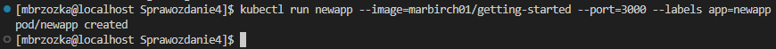
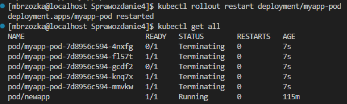

### Sprawozdanie 2
## Aby wykonać to ćwiczenie wykorzystałem następujące narzędzia:
* Visual Studio Code 
* VirtualBox, z zainstalowaną maszyną wirtualna z oprogramowaniem Fedory
* Śrokowisko Kubernetes

## Przebieg wykonywania ćwiczenia:

Celem ćwiczenia było zapozanie się z działaniem kontenerów w środowisku Kubernetes.

Pierszym krokiem było sprawdzenie poprawnego działania Dockera. W tym celu sprawdziłem czy komenda "docker ps" działa poprawnie


Następnie instalujemy i uruchamiamy środowisko Kubernetes używając komendy:

```bash
minikube start
```


Następnie instalujemy Kubectl


Następnym krokiem będzie ponowne uruchomienie minikube i uruchomienie dashboardu za pomocą polecenia:

```bash
minikube dashboard
```


Korzystając z programu Virtual Studio Code u oknie przeglądarki pod wskazanym adresem automatycznie wyświetli się okno Kubernetesa. Jest to możliwe dzięki połączeniu witrualnej maszyny z programem poprzez ssh.


W tym momencie przyda mi się kontener który przygotowłem na potrzebę poprzednich zajęć. Znajduję się on na moim koncie w serwisie Docker Hub. 


Pobieramy i uruchamiamy przygotowany obraz na naszej maszynie.


Następnie uruchamiamy naszego pierwszego poda. Robimy to bez utworzonego wcześniej pliku do deploymentu. Używamy do tego komendy która składa się z nazwy naszej aplikacji, obrazu który pobraliśmy na naszą maszynę oraz wybranego przez nas portu.



Aby upewnić się na utworzony przez nas pod działa poprawnie używamy polecenia 


Analizując wyniki użycia tej komendy możemy zauważyć że aplikacja która została przez nas stworzona i uruchomiona używa tylko jednego poda

Inną z metod sprawdzenia utworzonego przez nas poda jest uruchomienie go na wcześniej wybranym porcie i sprawdzenie czy jest on aktywny


Na maszynie wirualnej sprawdzamy działanie aplikacji za pomocą komendy

```bash
curl 127.0.0.1:3000/health
```


W kolejnym kroku ćwiczenia przygotowałem plik deployment.yaml. Plik ten został przygotowany zgodnie z instrykcją dostępną na oficjalnej stronie kubernetesa: https://kubernetes.io/docs/concepts/workloads/controllers/deployment/. W zakładce Creating a Deployment znajduję się przykładowy wzór pliku który musimy edytować tak aby spełniał on nasze potrzeby. W miejsca oznaczone "name" oraz "app" wpisujemy nazwę naszej aplikacji, natomiast w miejsce oznaczone "image" wpisujemy nazwę obrazu który pobraliśmy na naszą maszynę. Do pierwszego uruchomienia aplikacji dostawiamy domyślną liczbę "replicas" czyli w tym przypadku 3


Po przygotowaniu i dostosowaniu naszego pliku deployment.yaml uruchamiam go za pomocą polecenia: 

```bash
kubectl apply -f deployment.yaml
```


Aby sprawdzić czy nasze pody zostały poprawnie uruchomione uzywamy komendy


Widzimy że wszystkie z naszych 3 replik są w użytku. W kolejnym kroku możemy ponownie uruchomić naszą aplikację na porcie 3000 i sprawdzić jej poprawne działanie 


Uruchamiając nasz dashboard możemy również zauważyć że wszystkienasze pody działają poprawnie 


Następnym krokiem będzie edycja naszego pliku deployment. Zmieniamy liczbę "replicas" z początkowo ustawionych 3 na 4.


Oraz ponownie uruchomienie pliku i sprawdzenie czy wszytko działa poprawnie i czy liczba podów została zaktualizowana


Następnie wykorzystując materiały przygotowane na potrzeby poprzedniego ćwiczenia z Jenkinsa edytujemy nasz pipeline script w taki sposób aby na naszym koncie na Docker Hubie pojawiła się nowa werjsa naszego programu ze zmienionym tagiem. Na naszej maszynie logujemy się na Docker Hub i uruchamiamy przygotowany program w Jenkinsie.


Wchodząc na nasz profil na Docker Hub widzimy nową wersję która została dodana do naszego repozytorium


W kolejnym kroku powracamy do naszej maszyny i pobieramy nową wersję naszego obrazu


Następnym krokiem będą zmiany w pliku deployment. Pierwszą zmianą będzie ustawienie wartości "replicas" na wartość 1 i sprawdzenie daziałania programu


Po wykonaniu tego kroku odpalany dashboard i sprawdzamy czy wprowadzone przez nas zmiany są tam widoczne 


Widzimy że w oknie dashboardu również liczba podów zmniejszyła się do 1.

Kolejnym krokiem będzie ponowna edycja pliku deployment.yaml i ustawienie wartości "replicas" na wartość 0. Po dokonaniu edycji powtarzamy wyżej wymienione kroki.


Możemy zauważyć że po zmianie warości na 0 program zatrzymuje się.

Następnie za pomocą komendy:

```bash
kubectl rollout history deployment/myapp-pod
```
Jesteśmy w stanie sprawdzić historię zmian wersji naszej aplikacji.


Możemy również wrócić do poprzedniej wersji naszej aplikacji używając komendy:

```bash
kubectl rollout undo deployment myapp-pod
```
Komenda ta jest wyjątkowo przydatna w przypadku awarii.

Dodając na koncu tej komendy "--to-revision=12" Jesteśmy w stanie wrócić również do konkretnej wersji naszej apliakcji. 


Następnie używamy komendy:

```bash
kubectl get all
```

Która pozwala nam zobaczyć wczęsniejsze wersję aplikacji 


Używając komendy:

```bash
kubectl describe deployment myapp-pod
```

Jesteśmy w stanie zobaczyć szczegółowe informację na termat naszych wdrożeń takie jak strategia wdrożenia czy informacje o kontenerach.

Odpalając dashboard jesteśmy w stanie zobaczyć zmianę naszych obrazów


W następnym kroku zajmiemy się strategiami wdrożenia które nie są uwzględnione w przykładzie naszego pliku deployment

Jedną z dostępnych strategii jest "Recreate". Wprowadzamy ją w pliku deployment.yaml w następujący sposób.


Umożliwia ona tworzenie nowych podów odrazu po restarcienaszego deploymentu. Usuwa ona stare pody a na ich miejsce pojawiają się nowe.

Aby zaobserwować działanie tej strategi wykorzystujemy komendę:

```bash
kubectl rollout restart deployment/myapp-pod
```
oraz 
```bash
kubectl get all
```




Kolejną strategią będzie "Rolling Update". 


Sposób jej działania polega na tworzeniu nowych podów w momencie w którym stare są unicestwiane. Polae "maxSurge" pozwala ustalić maksymalną ilość podów która może być skalowana przy replikacji. Ustawienie tej wartości na 25% oznacza że maksymalna ilość dla starych i nowych podów które istnieją w danym momencie wynosi 125%. Natomiast "maxUnavailable" wskazuję ile maksymalnie podów na raz może być niedostępne w momencie restartu. 

Ponownie wykonujemy zestaw komend wymienionych powyżej i obserwujemy zmiany.

